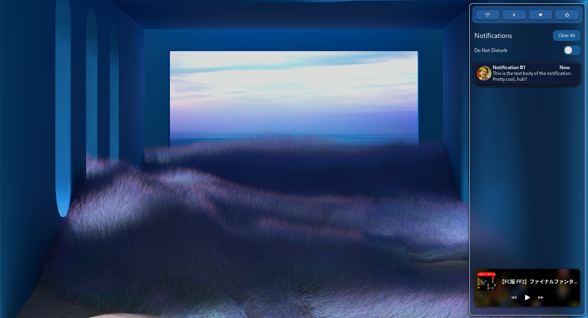

My custom config of [SwayNotificationCenter](https://github.com/ErikReider/SwayNotificationCenter) with [Pywal](https://github.com/dylanaraps/pywal)

I would recommend running swaync with `GTK_DEBUG=interactive swaync` using GTK's inspector tool when customizing style

## Screenshot


## Setup
Install [SwayNotificationCenter](https://github.com/ErikReider/SwayNotificationCenter) and [Pywal](https://github.com/dylanaraps/pywal) using your package manager

1. Clone repository
```
git clone https://github.com/Floresce/swaync-config.git
```
2. Copy config to swaync's config location
```
cp -r swaync-config/.config/swaync ~/.config/
```
3. Generate color palette using Pywal
```
wal -i "path/to/img" -s -t
```
4. Reload SwayNotificationCenter config
```
swaync-client --reload-config
```
5. Reload SwayNotificationCenter css
```
swaync-client -rs
```

